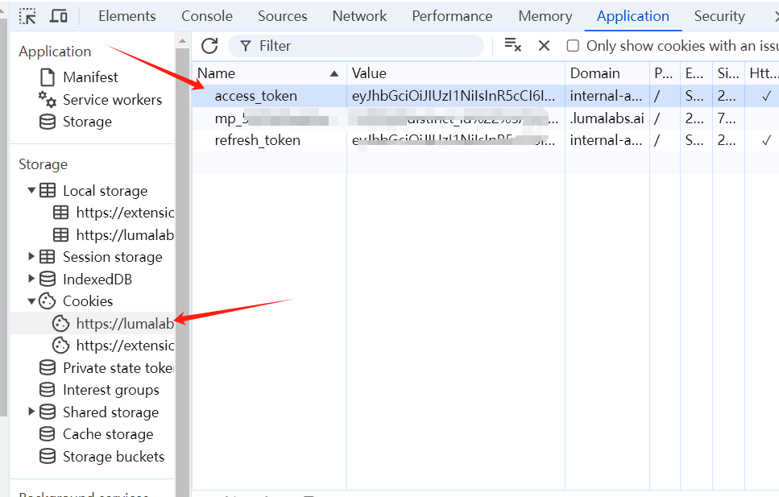
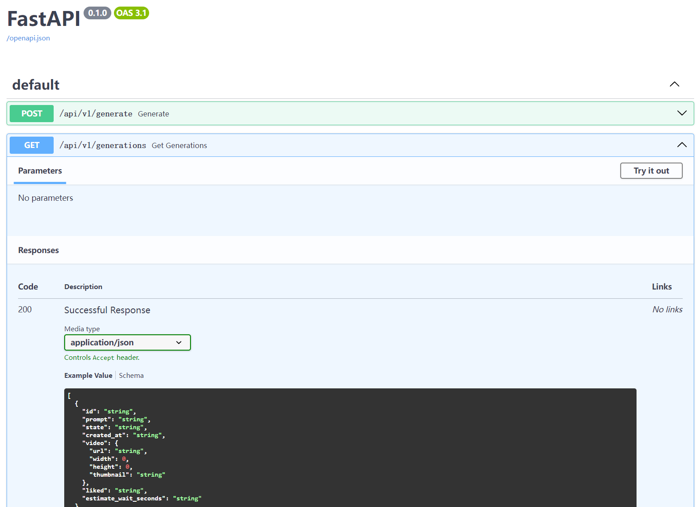

## Unofficial API
This is an unofficial Dream Machine API based on Python and FastAPI. It currently supports generating videos, extend videos, get generations, etc.

## Community

https://discord.gg/rBqQz7EHrs

## Installation
```bash
poetry install --no-root
```

## Setup

### Found your `access_token`


### Add to `settings.py`

```shell
cp settings.demo.py settings.py
vi settings.py
# add access_token
```

### Start the server
```bash
fastapi dev main.py
```

## API 
### Generate Video
http://127.0.0.1:8000/api/v1/generate

### Get Generations
http://127.0.0.1:8000/api/v1/generations

Full API documentation can be found at http://127.0.0.1:8000/docs  
